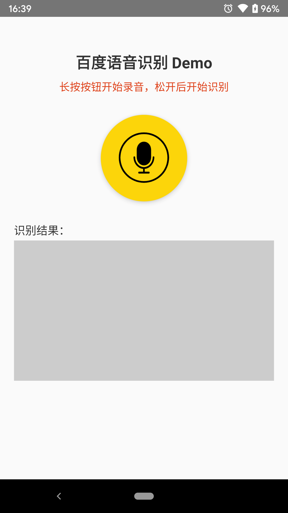

## 百度语音识别 REST-API Demo (React-Native)

React Native 版本的 Demo，展示如何使用百度语音识别 REST-API 快速、简便地集成语音识别功能。

UI:

References:

- [百度语音识别 REST-API 文档](https://ai.baidu.com/ai-doc/SPEECH/Vk38lxily)
- [react-native-audio](https://github.com/jsierles/react-native-audio)
- [rn-fetch-blob](https://github.com/joltup/rn-fetch-blob)